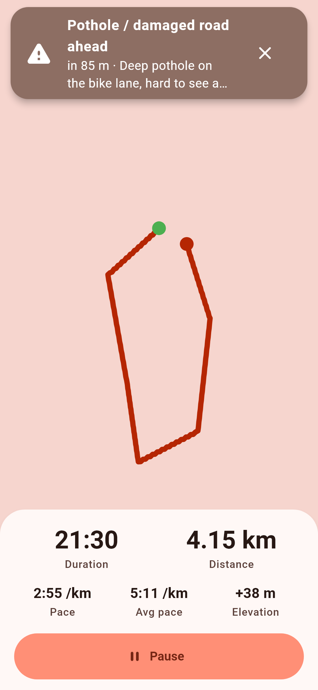
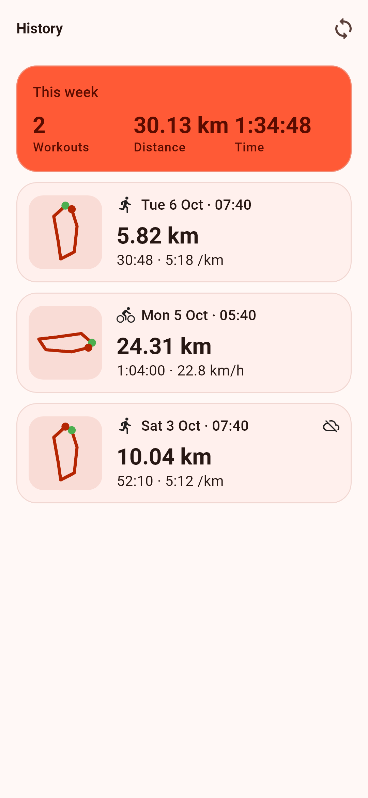
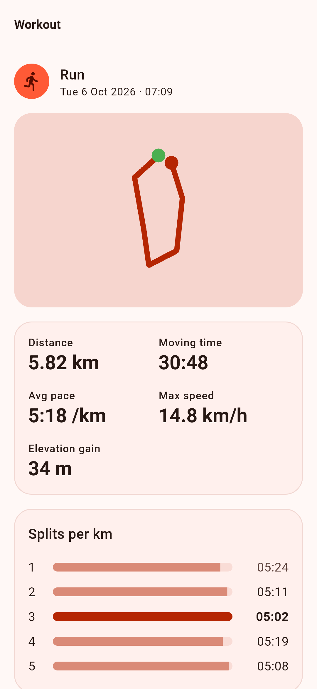
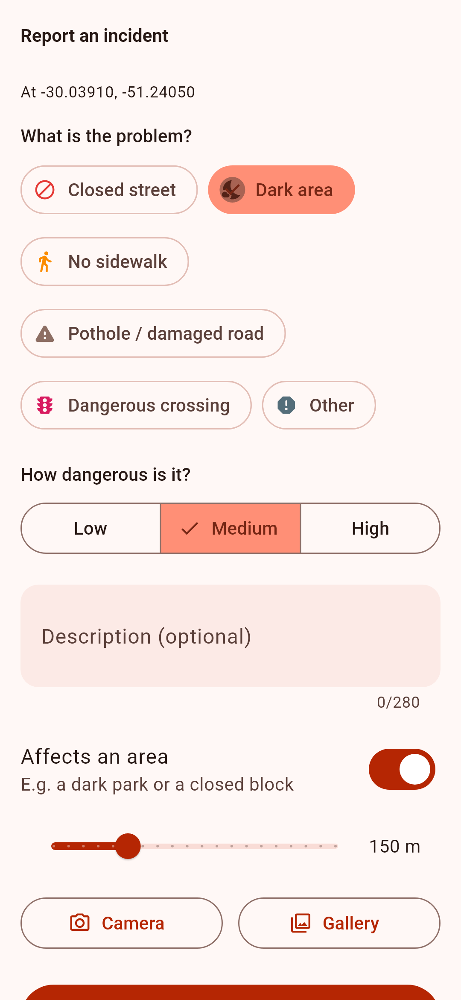
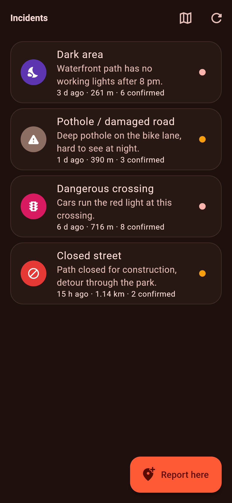
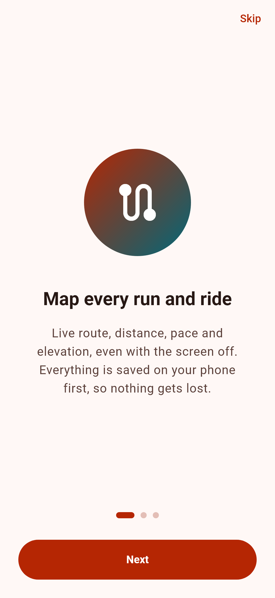
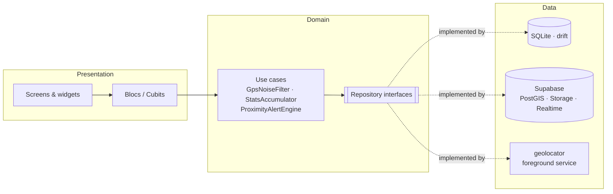

<p align="center">
  
</p>

<h1 align="center">PulseRoute</h1>

<p align="center">
  GPS workout tracking with a community safety layer for runners and cyclists.
</p>

<p align="center">
  <a href="https://github.com/FGTLight/pulseroute/actions/workflows/ci.yml"></a>
  <a href="https://github.com/FGTLight/pulseroute/releases/latest"></a>
</p>

---

Runners and cyclists share a problem maps don't solve: the path that looks fine on screen has a dark stretch, a missing sidewalk or a dangerous crossing. **PulseRoute** records your runs and rides like a classic GPS tracker, and overlays **incidents reported by the community** (closed streets, dark areas, potholes and more). It **warns you before you reach one** on your path, even with the screen off.

It is a portfolio project, built to production standards: feature-first clean architecture, BLoC, offline-first storage, PostGIS geo queries, Realtime, strict linting and **139 automated tests**.

## Features

**Live tracking**
- Start, pause, resume, finish or discard runs and rides. Tracking keeps going with the screen off (Android foreground service with a persistent notification; background location on iOS).
- Live route polyline with distance, moving time, current and average pace (min/km for runs) or speed (km/h for rides), and elevation gain.
- GPS noise filtering: low-accuracy fixes, impossible jumps and stationary jitter are dropped, and positions are smoothed with accuracy-weighted averaging.
- Every point is saved to SQLite immediately. A workout interrupted by the app being killed is **recovered on restart**.
- Summary with per-km splits; workouts upload to Supabase when finished, or later when back online.

**Safety layer**
- Category-colored markers (drawn at runtime) with **native clustering**; area reports such as dark parks are drawn as translucent circles.
- Report with a long-press on the map or "Report here": category, severity, description, optional area radius and a compressed photo (camera or gallery → Supabase Storage).
- Community validation: "still there" and "resolved" votes, one per user. Incidents expire after 14 days unless confirmed, and show their confirmation count and age.
- **Realtime**: new reports and votes appear on everyone's map without refreshing.
- **Proximity alerts**: while recording, a notification and vibration fire when an active incident is within the alert radius **ahead on your path**. Each incident alerts once per workout.

**History and settings**
- History with route thumbnails and weekly totals; workout detail with full route, splits and **the incidents that were near the route**.
- Units (km/mi), alert radius and toggle, light/dark/system theme, sign out and **account deletion**.
- Onboarding with a location disclosure, offline banner, empty/loading/error states, haptics and an adaptive layout for tablets.

## Screenshots

| Tracking + alert | History | Workout detail |
| :---: | :---: | :---: |
|  |  |  |

| Report incident | Incidents (dark) | Onboarding |
| :---: | :---: | :---: |
|  |  |  |

> Screenshots are rendered from the real widgets with fake data by [`tool/screenshots/screenshots_test.dart`](tool/screenshots/screenshots_test.dart). Google Maps tiles cannot load in tests, so routes are drawn with the app's own `RoutePainter` on a plain background.

## Tech stack

| Concern | Choice |
| --- | --- |
| Framework | Flutter 3.47 · Dart 3.13 (Android first, iOS configured) |
| State management | `flutter_bloc` (Bloc + Cubit) with `equatable` |
| Dependency injection | `get_it` (composition root only) |
| Navigation | `go_router` with `StatefulShellRoute` and auth/onboarding redirects |
| Maps | `google_maps_flutter` (polylines, circles, custom markers, native clustering) |
| Location | `geolocator` (foreground service), `permission_handler` |
| Backend | Supabase: Auth (password + magic link), Postgres + **PostGIS**, Storage, Realtime |
| Local storage | `drift` (SQLite) with migrations |
| Notifications | `flutter_local_notifications` |
| Quality | `very_good_analysis`, `bloc_test`, `mocktail`, GitHub Actions |

## Architecture

Feature-first clean architecture. Every feature has `data`, `domain` and `presentation` layers, and dependencies point inward, toward `domain`:

```
lib/
├── core/            # env, errors (Failure/Result), DI, database, router, theme, utils, shared widgets
└── features/
    ├── auth/        # Supabase auth, profiles, session
    ├── tracking/    # GPS, noise filter, stats, recording, recovery
    ├── workouts/    # history, sync, workout detail
    ├── incidents/   # reports, votes, realtime, proximity alerts
    ├── map/         # shared map layers, marker icons, clustering
    ├── settings/    # preferences, account
    └── onboarding/
```



- **Domain** is pure Dart: entities, repository interfaces, use cases and the core algorithms (noise filter, stats, splits, proximity rules). It is fully unit tested.
- **Data** implements the interfaces and translates exceptions into typed `Failure`s, returned as `Result<T>`, so nothing throws into the UI.
- **Presentation** renders state and dispatches events; no business logic lives in widgets.

## Technical highlights

**Background location.** Recording uses `geolocator`'s Android foreground service (`FOREGROUND_SERVICE_LOCATION`) with an ongoing notification, so "while in use" permission is enough and the app never needs "all the time" access. Before asking, the app explains why it needs location (the prominent disclosure Google Play requires). It handles denied, permanently denied and GPS-off states, and suggests disabling battery optimization. Proximity alerts subscribe to the tracking bloc's stream, not to widgets, so they also fire with the screen off.

**Offline-first tracking.** Each accepted point is written to SQLite immediately (with millisecond timestamps). Finished workouts upload with a client-generated UUID, so retries are idempotent; pending uploads retry on app start and when connectivity returns. The local database is the source of truth for history, and workouts from other devices are imported on refresh.

**PostGIS geo queries.** Routes are stored as `geography(LineString)` and incidents as `geography(Point)` with GIST indexes. RPCs use `ST_DWithin` for meter-accurate searches: `incidents_nearby`, `incidents_along_route` and `incidents_for_workout` (which also includes incidents resolved *after* the workout). Computed fields expose routes as JSON, so the app never parses PostGIS binary formats.

**Realtime and community validation.** A Realtime channel streams incident inserts, updates and deletes; the bloc merges them while preserving the user's own vote, and applies votes optimistically with rollback. A Postgres trigger maintains counters, expiry and status; column-level grants keep reporters from editing them, and RLS enforces one vote per user.

**GPS signal processing.** Fixes are rejected for low accuracy, impossible speeds (per activity) and jitter, then smoothed with accuracy-weighted averaging. Smoothing trails the newest fix by about one sample, so a `flush()` adds the last real fix when a segment ends; a test caught this ~10 m loss. Elevation gain uses hysteresis; splits interpolate the exact boundary crossing time and exclude pauses.

## Getting started

### 1. Supabase

1. Create a project at [supabase.com](https://supabase.com).
2. Apply [`supabase/migrations`](supabase/migrations) in order (SQL Editor or `supabase db push`), then optionally [`supabase/seed.sql`](supabase/seed.sql) for demo incidents in Porto Alegre.
3. Under **Authentication → URL Configuration → Redirect URLs**, add `io.pulseroute://login-callback` (magic links).

See [`supabase/README.md`](supabase/README.md) for the data model, RLS and RPC details.

### 2. Google Maps

Create a key with **Maps SDK for Android** enabled (and **Maps SDK for iOS** if needed). Restrict it to the package `dev.fabianguevara.pulseroute` and your signing certificate SHA-1.

### 3. Environment

Keys are never committed. Copy the template and fill it in:

```bash
cp .env.example .env
```

```env
SUPABASE_URL=https://your-project-ref.supabase.co
SUPABASE_PUBLISHABLE_KEY=sb_publishable_...
MAPS_API_KEY=AIza...
```

The values are compiled in with `--dart-define-from-file`. On Android, Gradle reads `MAPS_API_KEY` from the dart-defines and injects it into the manifest. For iOS, copy `ios/Flutter/Secrets.xcconfig.example` to `Secrets.xcconfig` (also git-ignored).

### 4. Run

```bash
git clone https://github.com/FGTLight/pulseroute.git
cd pulseroute
flutter pub get
dart run build_runner build
flutter run --dart-define-from-file=.env
```

If the app is started without the Supabase keys, it shows a screen listing what is missing instead of crashing.

## Tests

```bash
flutter analyze
flutter test
```

139 tests cover:
- **Algorithms:** haversine distance and bearings, GPS noise filter, incremental stats, splits, and proximity alert rules (ahead/behind, area edges, no repeats).
- **Blocs** (`bloc_test` + `mocktail`): tracking (start, pause, resume, finish, discard, recovery, permissions), incidents (Realtime merge, optimistic votes), proximity alerts, history, session, forms and settings.
- **Data:** drift repositories on an in-memory SQLite (recovery, cascades, schema-v2 previews, server import) and Supabase row mapping.
- **Widgets:** the report-incident form and the workout summary, plus a full navigation flow (onboarding → sign in → tabs → settings).

## Build the APK

```bash
flutter build apk --release --dart-define-from-file=.env
```

The output is `build/app/outputs/flutter-apk/app-release.apk`. The release build is signed with the debug key; add your own keystore in `android/key.properties` (git-ignored) for Play Store distribution.

### CI/CD

[`.github/workflows/ci.yml`](.github/workflows/ci.yml) runs on every push:

1. Formatting, `flutter analyze` and `flutter test`.
2. Builds the release APK with keys from **repository secrets** (`SUPABASE_URL`, `SUPABASE_PUBLISHABLE_KEY`, `MAPS_API_KEY`) and uploads it as an artifact.
3. On tags like `v1.0.0`, attaches the APK to a GitHub Release.

## Notes

- `ACCESS_BACKGROUND_LOCATION` is declared but never requested: the foreground service only needs "while in use". If you publish on Google Play, remove it from `AndroidManifest.xml` to avoid the background-location review. `REQUEST_IGNORE_BATTERY_OPTIMIZATIONS` is likewise restricted by Play policy.
- iOS is configured (permissions, background mode, URL scheme, Maps key) but was not built in this project's CI.

## Author

**Fabian Guevara Torguet**, Full Stack & Mobile Developer · fgtdev753@gmail.com
