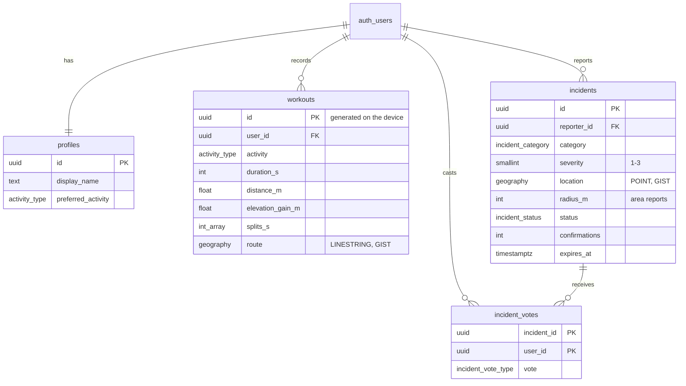

# Supabase backend

Everything the app needs on the server lives in this folder:

| File | What it creates |
| --- | --- |
| `migrations/…0100_extensions_and_helpers.sql` | PostGIS (in the `extensions` schema), `set_updated_at()` trigger helper |
| `migrations/…0200_profiles.sql` | `profiles` table, auto-created on sign up from the auth metadata |
| `migrations/…0300_workouts.sql` | `workouts` with a `LINESTRING` geography route, GIST index, `route_points` / `route_preview` computed fields |
| `migrations/…0400_incidents.sql` | `incidents` (`POINT` geography), `incident_votes` (one per user), vote trigger, Realtime publication |
| `migrations/…0500_geo_functions.sql` | RPCs `incidents_nearby`, `incidents_along_route`, `incidents_for_workout` (`ST_DWithin`) |
| `migrations/…0600_storage.sql` | Public `incident-photos` bucket (2 MB, images only) with per-user folder policies |
| `migrations/…0700_account.sql` | `delete_account()` RPC |
| `seed.sql` | 12 demo incidents in Porto Alegre, Brazil |

Row Level Security is enabled on every table.

## Option A: SQL Editor (no tools needed)

1. Create a project at [supabase.com](https://supabase.com).
2. Open **SQL Editor → New query**, then paste and **Run** each file in
   `migrations/` **in order** (by file name).
3. Optional: run `seed.sql` to add the demo incidents.

## Option B: Supabase CLI

```bash
supabase link --project-ref <your-project-ref>
supabase db push                      # applies ./migrations
psql "$DATABASE_URL" -f supabase/seed.sql   # optional demo data
```

For a fully local stack (Docker): `supabase start`, then `supabase db reset` applies the migrations and the seed.

## Auth settings

In **Authentication → Providers**, keep **Email** enabled. To use magic links on Android, add this redirect URL in **Authentication → URL Configuration → Redirect URLs**:

```
io.pulseroute://login-callback
```

## Data model



## Incident lifecycle

- New incidents are `active` and expire after **14 days**.
- Each **confirm** vote extends the expiry to at least **7 days from now**.
- An incident becomes `resolved` when its reporter marks it resolved, or when at least **2 users** vote resolve and they are not outnumbered by confirmations.
- Counters, status and expiry are maintained by the `apply_incident_vote` trigger. Reporters can only edit the descriptive columns (enforced with column-level grants).
- Expired incidents are filtered out by every query, so no cron job is needed.

## Geo queries

```dart
// Incidents within 2 km of the user, nearest first.
await supabase.rpc('incidents_nearby', params: {'lat': lat, 'lng': lng, 'radius_m': 2000});

// Incidents within 50 m of a route (EWKT linestring).
await supabase.rpc('incidents_along_route', params: {
  'route': 'SRID=4326;LINESTRING(-51.24 -30.04, -51.23 -30.05)',
  'buffer_m': 50,
});
```
